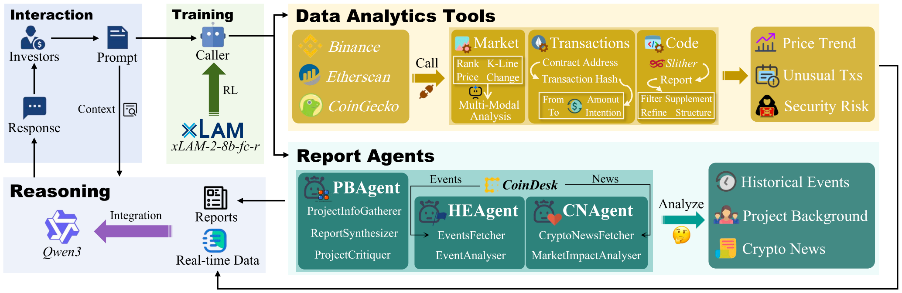
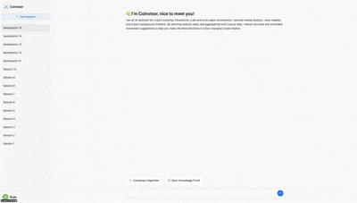

# Coinvisor: A Tool-Augmented Reinforcement Learning Agent for Cryptocurrency Investment 🚀

## 📌 Overview

***Coinvisor*** is an intelligent chatbot that revolutionizes cryptocurrency investment analysis through reinforcement learning-based tool call and multi-agent collaboration. By addressing the critical gap between fragmented data sources and investment decision-making, ***Coinvisor*** provides comprehensive, real-time analysis through natural conversation.

## 🎬 Demo

A demo video demonstrating interaction with ***Coinvisor*** : 

## ✨ Key Features

### 📊 Market Analysis
Real-time price monitoring, trading volume analysis, and K-line chart visualization through Binance API integration. Identifies market trends, top gainers/losers, and provides multi-modal analysis including visual chart interpretation.

### 🔍 Transaction Analysis
Detects and analyzes large-scale token transfers exceeding $100,000. Infers transaction intent, identifies whale movements, and assesses potential market manipulation signals.

### 🛡️ Smart Contract Security
Automated vulnerability detection using Slither static analysis combined with LLM-based refinement. Filters false positives and provides severity-classified security assessments.

### 📚 Project Intelligence
Comprehensive project evaluation through web-sourced information gathering, including technical specifications, team credentials, and tokenomics analysis via the PBAgent module.

### 📰 Event & News Monitoring
- **Historical Events**: Tracks security incidents, regulatory announcements, and protocol upgrades for long-term risk pattern recognition
- **Real-time News**: Continuous market sentiment analysis and trend detection through cryptocurrency news monitoring

## 🔧 Technical Innovation

### 🎯 Reinforcement Learning-Enhanced Tool Call
PPO-trained tool call achieving 40.7% improvement in recall and 26.6% increase in F1 score, enabling comprehensive multi-step analysis.

### 🤖 Multi-Agent Framework
Specialized sub-agents coordinate to gather and synthesize information from diverse sources, providing holistic investment insights that single-agent systems cannot achieve.

### 🧠 Adaptive Reasoning
Dynamic analytical approach that scales from single tool calls for simple queries to coordinated multi-tool analysis for complex investment decisions.

## 🏗️ System Architecture

**Caller Module**: RL-tuned xLAM-2-8b-fc-r model orchestrating tool call through multi-step decision-making

**Data Analytics Tools**: Direct API integrations with Binance, Etherscan, and CoinGecko for real-time data retrieval and specialized analysis

**Report Agents**: Three specialized LLM-based agents (PBAgent, HEAgent, CNAgent) providing structured insights for investment reasoning